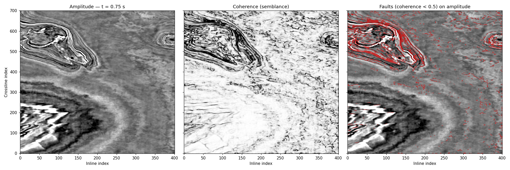

# Seismic Workbench

A lightweight seismic processing & interpretation package in Python:
SEG-Y I/O, gather and volume visualization, signal processing, semblance
velocity analysis, NMO correction, CMP stacking, complex-trace
attributes, and coherence-based fault highlighting — validated against
built-in synthetic forward models with known ground truth, and
demonstrated on the real F3 Netherlands volume.


*F3 Netherlands, 0.75 s time slice: amplitude (left), semblance
coherence (centre), fault overlay (right). Full cube computed in ~3 s.*

## Quick start

```
pip install -r requirements.txt
streamlit run app/streamlit_app.py
```

**Pre-stack mode:** generate a synthetic CMP gather (or upload a
pre-stack SEG-Y), then walk the pipeline: view → filter/AGC →
semblance → pick velocities → NMO → stack.

**Post-stack mode:** load a synthetic 3D volume, a 3D SEG-Y, or the F3
benchmark; navigate inline/crossline/time slices; compute Hilbert
attributes (envelope, instantaneous phase/frequency, RMS) and semblance
coherence with a fault-overlay co-render; export any attribute volume
back to SEG-Y.

To get the real F3 data (~1.2 GB, [Zenodo 3755060](https://zenodo.org/record/3755060)):

```
python scripts/download_f3.py data/f3
```

## Library

```python
from seisproc.synthetic import cmp_gather
from seisproc.velocity import semblance, pick_velocities
from seisproc.nmo import nmo_correct, stack, velocity_function

data, t, offsets = cmp_gather(noise=0.1)
vels = np.arange(1300, 3300, 25.0)
spec = semblance(data, offsets, 0.002, vels)
times, picks, _ = pick_velocities(spec, vels, 0.002)
v_t = velocity_function(t, times, picks)
section = stack(nmo_correct(data, offsets, 0.002, v_t))
```

```python
from seisproc.volume import from_npy
from seisproc.coherence import coherence

vol = from_npy("data/f3/data/train/train_seismic.npy", dt=0.004)
coh = coherence(vol.data, vol.dt)   # faults = low-coherence lineaments
```

Convention: arrays are `(n_traces, n_samples)` or
`(n_ilines, n_xlines, n_samples)`, time axis last; seconds, metres, m/s.

## Validation

`pytest tests/` — 38 tests that prove the physics, not just the plumbing:

- semblance peaks recover true RMS velocities within 5%
- NMO flattens synthetic hyperbolic events to ±2 samples
- stacking improves SNR over a single trace as theory predicts
- envelope recovers AM modulation; instantaneous frequency reads a pure
  tone correctly; RMS of a steady sine equals A/√2
- coherence locates a synthetic fault within ±1 crossline with a
  lineament continuous along every inline

## Roadmap

See [ROADMAP.md](ROADMAP.md). All three milestones complete:
M1 pre-stack pipeline, M2 post-stack attributes, M3A coherence fault
highlighting (validated on F3).

Future work (out of scope by design): assisted horizon tracking,
inversion, ML fault/salt detection, 3D rendering, full interpretation
workspace.
